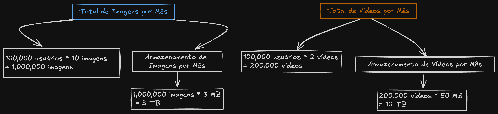
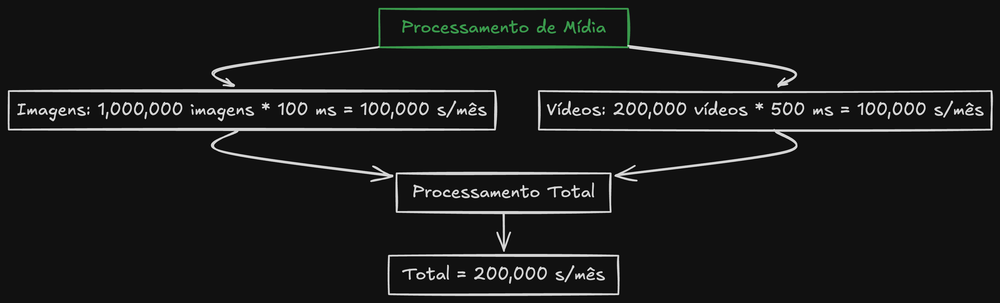
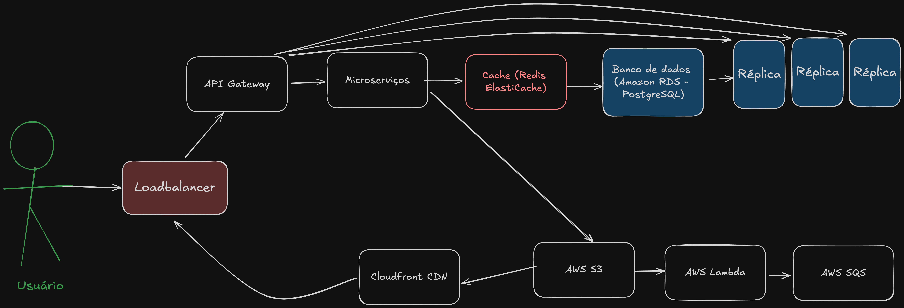

# Arquitetura de Software para o Alfinteresse

## 1. Introdução
Arquitetura criada para a ferramenta Alfinteresse, plataforma de descoberta visual, considerando aspectos técnicos e funcionais. Esta proposta detalha a arquitetura de software, a escolha da stack tecnológica, e a infraestrutura necessária para criar uma solução robusta, escalável e eficiente.

## 2. Casos de uso principais
1. **Lidar com diferentes formatos de mídia:**
   - Imagens, vídeos e links.
   - Origem variada: conteúdo criado por usuários, gerado pela plataforma, anúncios (ADs) e conteúdo externo que redireciona para outros sites.

2. **Recomendação de conteúdos relevantes:**
   - Personalizar a experiência do usuário com base em interesses e comportamento na plataforma.

3. **Funcionalidades Sociais:**
   - Salvar conteúdos em pastas.
   - Curtir e comentar conteúdos.

4. **Escalabilidade e Localização:**
   - A plataforma será utilizada por aproximadamente 100 mil pessoas, a princípio será uma solução apenas para o Brasil ou falantes de língua portuguesa.

## 3.  Preparação:
Considerando que a plataforma armazenará diferentes tipos de mídia (imagens, vídeos), podemos estipular alguns cálculo de uso.

- Número de usuários: 100 mil (MAU)
- Média de fotos postadas: 10
- Média de vídeos postados: 2
- Poderíamos estipular também outras interações dos usuários com a ferramenta e também mídias de links.

#### Imagem e vídeo:

#### Processamento de mídia:

#### Caching
- Tamanho médio de cache por usuário: 10 MB
- Total de Cache = 1 TB

### Serviços
Serviços necessários para os casos de usos:
- Mídia: Gerencia o upload, processamento e armazenamento de mídia.
- Recomendação: Gera recomendações personalizadas para os usuários.
- Interações: Gerencia curtidas e comentários.

## 4.  Diagrama de Arquitetura:
### Diagrama
Após toda a análise, criei um rascunho de como podemos organizar toda essa arquitetura: 

### Componentes Principais
#### Frontend
- **Aplicativo Web:** React.js
    - Biblioteca eficiente e flexível para construir interfaces, tem uma grande comunidade de suporte e já é utilizada pelo time.

#### Backend
- **API Gateway:** Centraliza e gerencia as chamadas de API.
    - Simplifica a gestão do tráfego, autenticação e roteamento.
- **Microserviços:** Mídia Service, Recomendação Service, Interações Service.
    - Permite escalabilidade independente, flexibilidade no desenvolvimento e implantação, além de maior resistência a falhas.

#### Infraestrutura
- **CDN:** CloudFront
    - Acelera a entrega de conteúdo e reduz a carga nos servidores.
- **Load Balancer:** Application Load Balancer
    - Aumenta a disponibilidade e escalabilidade.
- **Serviços de Armazenamento:** Amazon S3 para armazenar mídia
    - Oferece armazenamento escalável, durável e seguro, com integração fácil com outros serviços da AWS
- **Bancos de Dados:** Amazon RDS (PostgreSQL)
    - Fornece uma solução de banco de dados relacional robusta.
- **Cache**: Redis (ElastiCache)
    - Melhora o desempenho e reduz a carga nos bancos de dados, fornecendo acesso rápido aos dados frequentemente consultados.
- **Message Queue**: Amazon SQS
    - Permite comunicação assíncrona, maior resiliência e escalabilidade.

### Melhorias
Pontos extras que seriam interessantes de serem utilizados:
- **Monitoramento:** Datadog e Grafana
    - Monitoramento completo e visualização de métricas e logs. Tem o custo mais elevado e pode ser usado algumas outras alternativas (Sentry para erros).
- **CI/CD**: GitHub Actions
    - Automatiza os pipelines de CI/CD e facilita a integração contínua, além de utilizar o mesmo ambiente de controle de versão.
- **Análise de Dados:** Metabase
    - Permite a análise e visualização de dados de forma intuitiva e rápida, ajudando na tomada de decisões. Além de ser open source e ter uma comunidade de apoio.
- **IA:** Amazon SageMaker
    -  Treina modelos de machine learning para fazer melhores recomendações